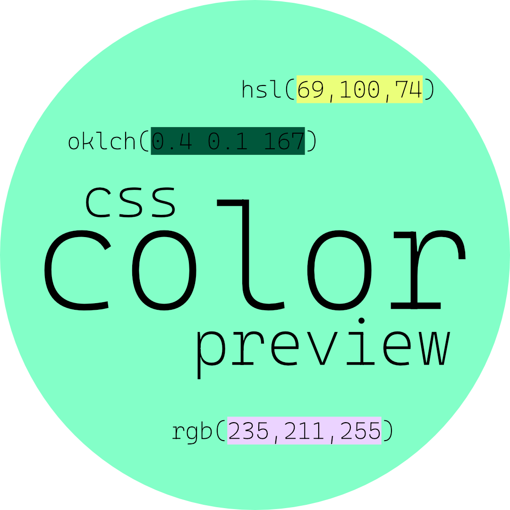

<h1 align="center">
  
</h1>

<p align="center">
  <a href="https://marketplace.visualstudio.com/items?itemName=luie.css-color-preview"></a>
  <a href="https://marketplace.visualstudio.com/items?itemName=luie.css-color-preview"></a>
</p>

<p align="center">
  Preview colors for CSS files in Visual Studio Code.
</p>

<p align="center">

</p>

## Custom File Patterns

By default, Color Preview works with standard CSS files (css, scss, sass, less, postcss).

You can configure the extension to support additional file patterns, such as CSS-in-JS files:

```json
"cssColorPreview.additionalFilePatterns": [
  "**/*.css.ts",
  "**/*.styles.ts",
  "**/*.styled.tsx"
]
```

## Acknowledgements:

- [OKLCH Preview](https://github.com/dotnize/oklch-preview) by dotnize, which this extension was forked from.

## License

[MIT](LICENSE)
